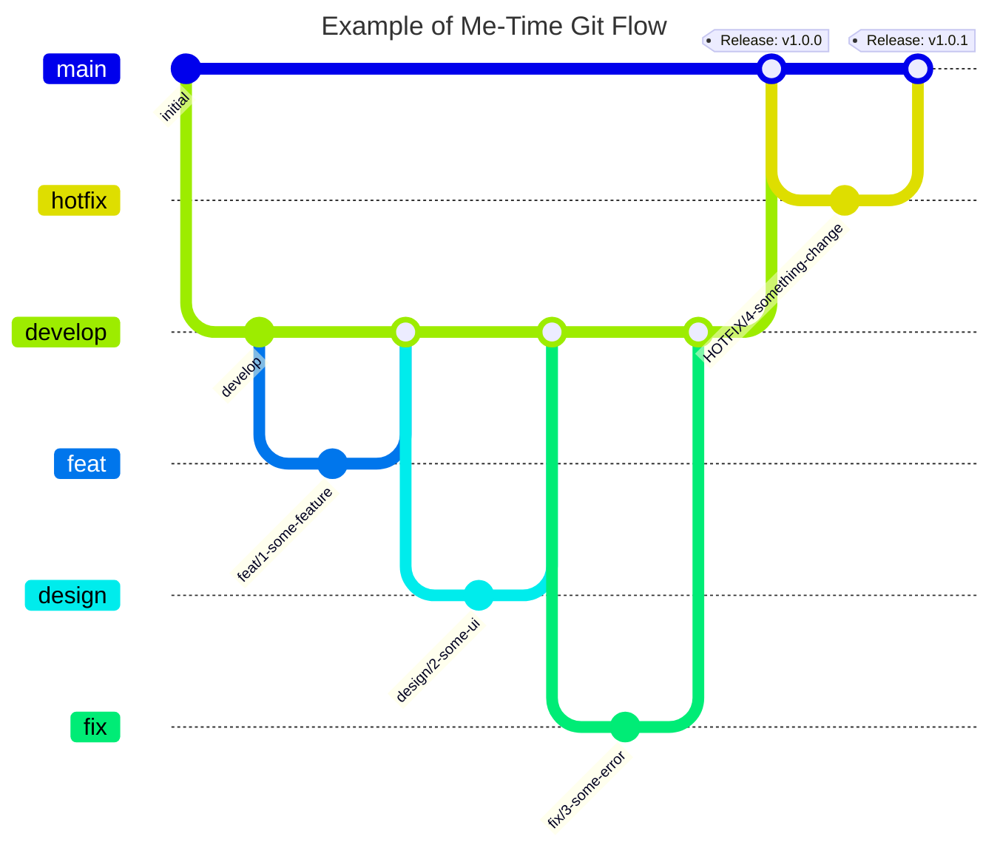

# ⏳ 미타임 (Me-Time) - 오롯이 나를 알아가는 시간

<br />

<div align="center">
  
  <br /><br />
  
  
    
  <br /><br />
   <a href="https://apps.apple.com/kr/app/me-time-%EB%AF%B8-%ED%83%80%EC%9E%84/id6711330732" target="_blank">
      
  </a>
</div>

<br />

## 기획의도 (Intention)
> ### “ 𝑴𝒆 𝑻𝒊𝒎𝒆 ”
> ### 나 혼자만의 시간, 나를 위한 휴식 시간, 나를 충전하는 시간

- 하루 24시간 중 우리는 얼만큼의 시간을 '나 자신'을 위해 사용할까요?
- 바쁜 일상에 치이며 그 속에서 작은 행복을 찾는 것도 보람있지만, '나를 잘 아는 사람'이 되는 것이 무엇보다 중요한 거 같습니다.
- 미타임은 하루 한 번, 오롯이 자기 자신에 집중하고 알아가는 시간을 가질 수 있도록 도와줍니다.
- 자신의 생각과 감정을 여과없이 적어내며 스스로 어떻게 살아가고 있는지 탐구하고 되돌아보며, 오롯이 자신에게 집중할 수 있는 시간을 제공합니다.

<br />

## 프로젝트 소개 (Description)
> **개발 기간** : 2024. 09. 12 ~ 2024. 10. 02 (약 3주)<br />
> **개발 인원** : 1인 (기획/디자인/개발)<br />
> **최소 버전** : iOS 16.0+<br />

<br /><br />

## 사용 기술 및 개발 환경  (Tech Stack & Environment)
- **iOS** : Swift 5.1, Xcode 15.4, SwiftUI, Charts, WebKit
- **Architecture** : MVVM
- **Reactive** : Combine
- **Network** : URLSession
- **Local DB** : Realm

<br />

## 아키텍쳐 (Architecture)
- 추가 예정

<br />

## 개발 방식 및 브랜치 전략 (Development & Branch Strategy)
### Issue, Pull Request(PR) 템플릿 활용한 프로젝트 관리
- 개발 시작 전 새로운 Issue 생성 후, Issue와 브랜치를 연결하고 이슈 번호를 브랜치명에 활용하여 일관된 작업 내용 기록
- Issue와 PR 생성 시 레이블을 표기하여 작업 종류와 진행사항을 한 눈에 알 수 있도록 처리
- PR 생성 시 템플릿에 맞게 작업 내용과 스크린샷을 상세히 기록하여 추후에도 프로젝트 진행 현황을 알 수 있도록 문서화

### 간소화된 Git Flow 도입
- **`main`**
  - 실제 서비스 배포용 브랜치
  - 큰 기능 단위 개발 작업이 완료된 후 병합 (Version Realese)
- **`dev`**
  - 개발 및 QA 작업용 브랜치 (Main 브랜치에서 분기)
  - 각 기능 단위 브랜치 작업이 완료된 후 병합
- **`feat`** , **`design`**, **`fix`**, **`refactor`**...
  - 작은 기능 단위 브랜치 (dev 브랜치에서 분기)
  - Issue, PR, Commit 컨벤션과 동일한 Prefix 사용하여 일관된 작업 구분
- 각 브랜치별 작업 내용 확인을 위해 브랜치명 컨벤션 도입
  - prefix/이슈번호-작업설명
  - `design/1-home-ui`



<details>
<summary><b>Prefix Convention 전체보기</b></summary>
<div>

| Prefix  | Description | Prefix  | Description | 
|------------|-----------|------------|-----------|
| Feat | 새로운 기능에 대한 커밋 | Style | UI 스타일에 관한 커밋 |
| Fix | 버그 수정에 대한 커밋 | Refactor | 코드 리팩토링에 대한 커밋 |
| Build | 빌드 관련 파일 수정에 대한 커밋 | Test | 테스트 코드 수정에 대한 커밋 |
| Chore | 그 외 자잘한 수정에 대한 커밋 | Init | 프로젝트 시작에 대한 커밋 |
| Ci | CI 관련 설정 수정에 대한 커밋 | Release | 릴리즈에 대한 커밋 |
| Docs | 문서 수정에 대한 커밋 | WIP | 미완성 작업에 대한 임시 커밋 |           

</div>
</details>

<br />

## 주요 기능 (Features)   
### 오늘의 첫 번째 감정과 모닝페이퍼를 기록하고 저장하는 기능
- Realm DB와 @ObservedResults
- Auto Refresh 기능으로 데이터 변경 시 모닝페이퍼 리스트 및 캘린더, 차트 상태를 실시간으로 반영
- 

### Custom TabBar
- 

<br />

### 

<br />

## 디렉토리 구조 (Directory Structure)
<details>
<summary><b>디렉토리 구조 전체보기</b></summary>
<div>
																			
```
📦 me-time
└─ me-time
   ├─ CustomView
   │  └─ CommonButton.swift
   ├─ Database
   │  ├─ MorningPaper.swift
   │  └─ MorningPaperTableRepository.swift
   ├─ Extension
   │  ├─ Color+.swift
   │  ├─ EnvironmentValues+.swift
   │  └─ Font+.swift
   ├─ Info.plist
   ├─ Localizable.xcstrings
   ├─ Manager
   │  ├─ DateFormatterManager.swift
   │  ├─ UserDefaultsManager.swift
   │  └─ YoutubeAPIManager.swift
   ├─ Model
   │  ├─ DateValue.swift
   │  ├─ Email.swift
   │  └─ YouTubeSearch.swift
   ├─ Presentation
   │  ├─ Data
   │  │  ├─ ChartView.swift
   │  │  ├─ CustomCalendarView.swift
   │  │  └─ DataView.swift
   │  ├─ LaunchScreen
   │  │  └─ LaunchScreenView.swift
   │  ├─ MorningPaper
   │  │  ├─ CommentView.swift
   │  │  ├─ DetailView.swift
   │  │  ├─ MorningPaperView.swift
   │  │  └─ WritingView.swift
   │  ├─ Music
   │  │  ├─ MusicDetailView.swift
   │  │  └─ MusicView.swift
   │  ├─ Onboarding
   │  │  └─ OnboardingView.swift
   │  ├─ Setting
   │  │  ├─ ChangeNicknameView.swift
   │  │  └─ SettingView.swift
   │  ├─ Tab
   │  │  └─ CustomTabView.swift
   │  └─ TodayEmotion
   │     └─ TodayEmotionView.swift
   ├─ Preview Content
   │  └─ Preview Assets.xcassets
   │     └─ Contents.json
   ├─ Resource
   │  ├─ Assets
   │  │  ├─ Assets.xcassets
   │  │  │  ├─ AccentColor.colorset
   │  │  │  │  └─ Contents.json
   │  │  │  ├─ AppIcon.appiconset
   │  │  │  │  ├─ AppIcon-01.jpg
   │  │  │  │  └─ Contents.json
   │  │  │  ├─ BackButton.imageset
   │  │  │  │  ├─ BackButton.svg
   │  │  │  │  └─ Contents.json
   │  │  │  ├─ Contents.json
   │  │  │  ├─ Lock.imageset
   │  │  │  │  ├─ Contents.json
   │  │  │  │  └─ Lock.svg
   │  │  │  ├─ TabBarBase.imageset
   │  │  │  │  ├─ Contents.json
   │  │  │  │  └─ TabBarBase.svg
   │  │  │  ├─ chart.imageset
   │  │  │  │  ├─ Contents.json
   │  │  │  │  └─ chart.svg
   │  │  │  ├─ disc.imageset
   │  │  │  │  ├─ Contents.json
   │  │  │  │  └─ disc.svg
   │  │  │  ├─ gradientBackground.imageset
   │  │  │  │  ├─ Contents.json
   │  │  │  │  └─ gradientBackground.svg
   │  │  │  ├─ grid.imageset
   │  │  │  │  ├─ Contents.json
   │  │  │  │  └─ grid.svg
   │  │  │  ├─ launchScreen.imageset
   │  │  │  │  ├─ Contents.json
   │  │  │  │  └─ launchScreen.svg
   │  │  │  └─ settings.imageset
   │  │  │     ├─ Contents.json
   │  │  │     └─ settings.svg
   │  │  └─ Color.xcassets
   │  │     ├─ Contents.json
   │  │     ├─ primaryBlack.colorset
   │  │     │  └─ Contents.json
   │  │     ├─ primaryGray.colorset
   │  │     │  └─ Contents.json
   │  │     ├─ primaryGreen.colorset
   │  │     │  └─ Contents.json
   │  │     ├─ primarySand.colorset
   │  │     │  └─ Contents.json
   │  │     └─ primaryWhite.colorset
   │  │        └─ Contents.json
   │  ├─ Constant.swift
   │  └─ Fonts
   │     ├─ DMSerifDisplay-Italic.ttf
   │     ├─ DMSerifDisplay-Regular.ttf
   │     ├─ GowunBatang-Bold.ttf
   │     ├─ GowunBatang-Regular.ttf
   │     ├─ Morena-Bold.otf
   │     ├─ Morena-ExtraLight.otf
   │     ├─ Morena-Light.otf
   │     ├─ Morena-Semibold.otf
   │     └─ Morena.otf
   ├─ Settings.bundle
   │  ├─ Root.plist
   │  ├─ com.mono0926.LicensePlist.latest_result.txt
   │  ├─ com.mono0926.LicensePlist.plist
   │  ├─ com.mono0926.LicensePlist
   │  │  ├─ realm-core.plist
   │  │  └─ realm-swift.plist
   │  └─ en.lproj
   │     └─ Root.strings
   ├─ Wrapper
   │  ├─ BackButtonWrapper.swift
   │  ├─ ButtonShapeWrapper.swift
   │  ├─ ButtonWrapper.swift
   │  └─ RoundedCorner.swift
   └─ me_timeApp.swift
```

©generated by [Project Tree Generator](https://woochanleee.github.io/project-tree-generator)
</div>
</details>

<br />

## 트러블 슈팅  (Trouble Shooting)
### 1. 단일 모닝페이퍼 데이터에 댓글 추가 시 트랜잭션(Transaction) 오류
- **원인** : 상위 View에서 @ObservedResults로 가져온 전체 모닝페이퍼 리스트 중에서 @ObservedRealmObject를 통해 하위 View로 단일 데이터를 보내주었을 때, @ObservedResults의 경우 프로퍼티 래퍼 내에서 자동으로 트랜잭션을 관리해주지만 @ObservedRealmObject는 Realm 객체를 개별로 관찰하기 때문에, 해당 객체를 변경하기 위해서는 명시적으로 트랜잭션을 관리해주어야 한다.
- **해결** : @ObservedRealmObject로 가지고 있던 단일 모닝페이퍼의 id값을 통해 Write Transaction 안에서 id가 일치하는 데이터를 찾아, 해당 데이터에 접근하여 댓글을 추가하는 방법으로 해결

```swift
// Realm 테이블 구조

import Foundation
import RealmSwift

final class MorningPaper: Object, ObjectKeyIdentifiable {
    @Persisted(primaryKey: true) var id: ObjectId
    @Persisted(indexed: true) var title: String
    @Persisted var content: String
    @Persisted var createAt: Date
    @Persisted var emotion: String
    @Persisted var commentData: List<Comment>
    
    convenience init(title: String, content: String, emotion: String) {
        self.init()
        self.title = title
        self.content = content
        self.emotion = emotion
        self.createAt = Date()
    }
}

final class Comment: Object, ObjectKeyIdentifiable {
    @Persisted(primaryKey: true) var id: ObjectId
    @Persisted var content: String
    @Persisted var createAt: Date
    
    convenience init(content: String) {
        self.init()
        self.content = content
        self.createAt = Date()
    }
}
```

```swift
// 기존
@ObservedRealmObject var detailData: MorningPaper
detailData.commentData.append(comment)

// 수정
@ObservedRealmObject var detailData: MorningPaper

do {
   let realm = try Realm()
   let data = realm.object(ofType: MorningPaper.self, forPrimaryKey: detailData.id)

   guard let data = data else { ... }
   try realm.write {
      data.commentData.append(comment)
   }
} catch {
    ...
}
```

<br />

### 2. Custom TabBar 사용 시 화면마다 TabBar Hidden 처리가 어려운 문제
- **원인** : SwiftUI에서 TabBar Hidden 처리 시 `.toolbar(.hidden, for: .tabBar)`를 활용할 수 있지만, Custom TabBar를 구성한 경우 해당 코드로 TabBar의 Hidden 처리를 핸들링할 수 없는 문제
- **해결** : @Environment Property Wrapper를 사용하여 각 화면마다 Custom TabBar를 Hidden 처리

```swift
import SwiftUI

private struct TabBarHiddenKey: EnvironmentKey {
    static let defaultValue: Binding<Bool> = .constant(false)
}

extension EnvironmentValues {
    var isTabBarHidden: Binding<Bool> {
        get { self[TabBarHiddenKey.self] }
        set { self[TabBarHiddenKey.self] = newValue }
    }
}
```

```swift
struct ContentView: View {
    @State private var isTabBarHidden: Bool = false

    var body: some View {
        ZStack {
            switch selectedTab {
            case .main:
                NavigationView {
                    MorningPaperView()
                        .environment(\.isTabBarHidden, $isTabBarHidden)
                }
            .
            .
            . 
            }
        }
    }
}
```

```swift
// 탭바가 필요없는 뷰에서 onAppear, onDisappear 시점마다 환경값 
struct detailView: View {
    @Environment(\.isTabBarHidden) private var isTabBarHidden: Binding<Bool>
    var body: some View {
        VStack { ... }
            .onAppear { isTabBarHidden.wrappedValue = true }
            .onDisappear { isTabBarHidden.wrappedValue = false }
    }  
}
```

<br />

## 회고
### Keep (좋았던 점)
- SwiftUI를 


### Problem (아쉬웠던 점)
- 

### Try (앞으로 시도해볼 점)
- 