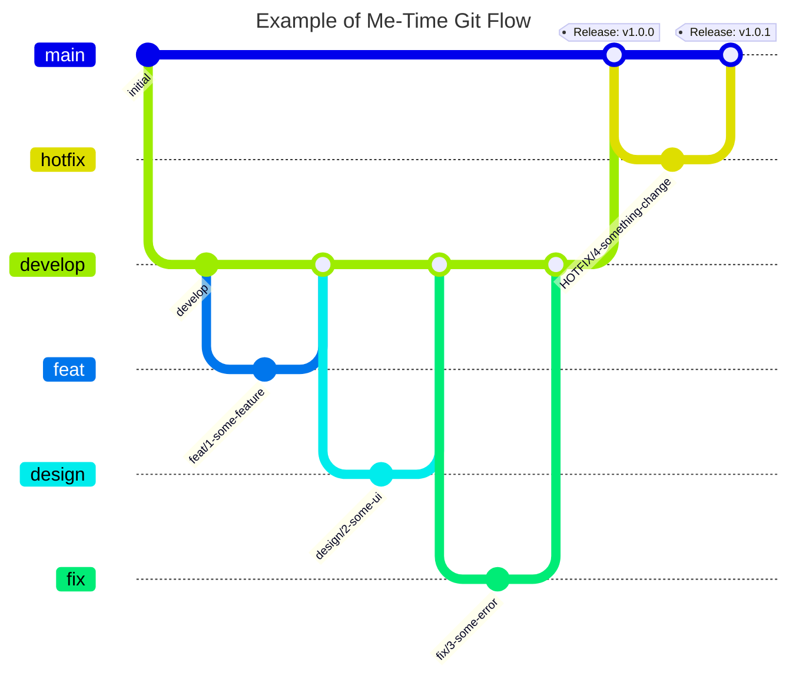

# ⏳ 미타임 (Me-Time) - 오롯이 나를 알아가는 시간

<br />

<div align="center">
  
  <br /><br />
  
  
    
  <br /><br />
   <a href="https://apps.apple.com/kr/app/me-time-%EB%AF%B8-%ED%83%80%EC%9E%84/id6711330732" target="_blank">
      
  </a>
</div>

<br />

## 기획의도 (Intention)
> ### 𝑴𝒆 𝑻𝒊𝒎𝒆 : 나 혼자만의 시간, 나를 위한 휴식 시간, 나를 충전하는 시간

- 하루 24시간 중 우리는 얼만큼의 시간을 '나 자신'을 위해 사용할까요?
- 바쁜 일상에 치이며 그 속에서 작은 행복을 찾는 것도 보람있지만, '나를 잘 아는 사람'이 되는 것이 무엇보다 중요한 거 같습니다.
- 미타임은 하루 한 번, 오롯이 자기 자신에 집중하고 알아가는 시간을 가질 수 있도록 도와줍니다.
- 자신의 생각과 감정을 여과없이 적어내며 스스로 어떻게 살아가고 있는지 탐구하고 되돌아보며, 오롯이 자신에게 집중할 수 있는 시간을 제공합니다.

<br />

## 프로젝트 소개 (Description)
> **개발 기간** : 2024. 09. 12 ~ 2024. 10. 02 (약 3주)<br />
> **개발 인원** : 1명 (기획·디자인·개발)<br />
> **최소 버전** : iOS 16.0+<br />
> **지원 모드** : 세로 모드, 라이트 모드

<br />

<div align="center">
  
  
  
  
  
</div>


<br /><br />

## 사용 기술 및 개발 환경  (Tech Stack & Environment)
- **Language & Tool** : Swift 5.1, Xcode 15.4
- **iOS** : SwiftUI, Charts, WebKit
- **Architecture** : MVVM
- **Design Pattern** : Input-Output, Repository, Singleton
- **Network** : URLSession
- **Reactive** : Combine
- **Management** : Git, GitHub, Figma

<br />

## 아키텍쳐 (Architecture)


- Combine과 MVVM 패턴을 활용해 UI와 Business Logic 분리 (View-ViewController 역할 분리)
- 사용자 액션을 열거형으로 관리하고, action 메서드를 통해 Input에 새로운 값을 전달하여 Output으로 변경된 데이터 방출

<br />

## 개발 방식 및 브랜치 전략 (Development & Branch Strategy)
### Issue, Pull Request(PR) 템플릿 활용한 프로젝트 관리
- 개발 시작 전 새로운 Issue 생성 후, Issue와 브랜치를 연결하고 이슈 번호를 브랜치명에 활용하여 일관된 작업 내용 기록
- Issue와 PR 생성 시 레이블을 표기하여 작업 종류와 진행사항을 한 눈에 알 수 있도록 처리
- PR 생성 시 템플릿에 맞게 작업 내용과 스크린샷을 상세히 기록하여 추후에도 프로젝트 진행 현황을 알 수 있도록 문서화

### 간소화된 Git Flow 도입
- **`main`**
  - 실제 서비스 배포용 브랜치
  - 큰 기능 단위 개발 작업이 완료된 후 병합 (Version Realese)
- **`dev`**
  - 개발 및 QA 작업용 브랜치 (Main 브랜치에서 분기)
  - 각 기능 단위 브랜치 작업이 완료된 후 병합
- **`feat`** , **`design`**, **`fix`**, **`refactor`**...
  - 작은 기능 단위 브랜치 (dev 브랜치에서 분기)
  - Issue, PR, Commit 컨벤션과 동일한 Prefix 사용하여 일관된 작업 구분
- 각 브랜치별 작업 내용 확인을 위해 브랜치명 컨벤션 도입
  - prefix/이슈번호-작업설명
  - `design/1-home-ui`



<details>
<summary><b>Prefix Convention 전체보기</b></summary>
<div>

| Prefix  | Description | Prefix  | Description | 
|------------|-----------|------------|-----------|
| Feat | 새로운 기능에 대한 커밋 | Style | UI 스타일에 관한 커밋 |
| Fix | 버그 수정에 대한 커밋 | Refactor | 코드 리팩토링에 대한 커밋 |
| Build | 빌드 관련 파일 수정에 대한 커밋 | Test | 테스트 코드 수정에 대한 커밋 |
| Chore | 그 외 자잘한 수정에 대한 커밋 | Init | 프로젝트 시작에 대한 커밋 |
| Ci | CI 관련 설정 수정에 대한 커밋 | Release | 릴리즈에 대한 커밋 |
| Docs | 문서 수정에 대한 커밋 | WIP | 미완성 작업에 대한 임시 커밋 |           

</div>
</details>

<br />

## 주요 기능 (Main Feature)
### 모닝페이퍼 (일기)
> 작성, 열람, 댓글
- Realm 데이터베이스를 활용한 모닝페이퍼 및 댓글 저장
- 모닝페이퍼 작성 날짜와 열람하려는 날짜를 비교하여 열람 가능/불가능 처리
- 1일 1작성 원칙을 기준으로 모닝페이퍼와 댓글 작성 예외 처리

### 오늘의 첫 번째 감정
> 캘린더, 차트 조회, 음악 추천
- 긍정적인 감정과 부정적인 감정을 합쳐 총 28개의 데이터 제공
- ‘오늘의 첫 번째 감정’ 데이터를 활용하여 시각화된 통계 정보 제공
- 사용자가 선택한 감정 기반으로 음악 플레이리스트 콘텐츠 추천

<br />

## 주요 기술 구현 내용 (Implementation Details)

### Combine과 Input-Output 패턴을 적용한 MVVM 아키텍쳐 설계
- Input, Output을 정의하고 transform 메서드를 통해 입출력 흐름을 관리하는 ViewModelType 프로토콜 구현
- View에서 발생하는 사용자 액션을 열거형으로 관리하고, action 메서드를 통해 Input에 새로운 값 전달 처리
- @Published를 활용해 Output에 변경사항 발생 시 View에 반영

<br />

### Realm 데이터베이스를 활용한 서비스 핵심 기능 구현
- 앱에서 사용할 모닝페이퍼(일기)와 댓글 모델을 정의하고 List 타입을 통해 1:N 관계 설정
- @ObservedResults를 활용해 Realm DB 변화를 관찰하여 변경사항에 따라 View 업데이트
- @ObservedRealmObject 사용 시 수동 트랜잭션을 대응하여 모닝페이퍼 내 댓글 작성 기능 구현

<br />

### 날짜 관련 메서드 정의와 핸들링을 위한 DateFormatterRepository 구현
- 일기 형태를 띄는 서비스 특성을 고려하여 날짜와 관련된 메서드를 한 곳에서 정의하여 관리
- 포맷팅 할 문자열 케이스를 열거형으로 정의하고, Date 타입을 문자열로 포맷팅 시 해당 열거형 활용
- 모닝페이퍼 작성 날짜와 오늘 날짜(열람 하려는 날짜)를 비교하여 열람 가능/불가능 분기 처리

<br />

### UI 렌더링 최적화, 공통 컴포넌트 관리
- WrapperView를 사용해 ForEach 구문에서 데이터 변경 시 화면이 리렌더링되며 일어나는 불필요한 액션 방지
- 앱에서 공통으로 사용하는 UI를 별도의 컴포넌트로 정의하여 코드 중복을 최소화하고, 재사용성 및 유지보수 고려 
- iOS 17.0 이상과 이전 버전에서 사용하는 modifier를 핸들링하는 CustomModifier 구현

<br />

### 커스터마이징 캘린더와 Charts를 활용한 데이터 통계 시각화
- Realm DB에 저장된 모든 데이터 가져와 선택된 날짜에 따라 필터링하여 캘린더 및 차트에 바인딩
- 일별 데이터에 따라 캘린더 내 해당 일에 ‘오늘의 첫 번째 감정’ 이모지 표시 제공
- 월별 데이터에 따라 BarMark를 통해  ‘오늘의 첫 번째 감정’ 데이터 통계 시각화
- 데이터가 존재하지 않는 날짜에는 EmptyView 노출

<br />

### UI 차별화를 위한 커스터마이징 탭바 구현 & 예외 처리
- 탭바로 사용할 화면을 열거형으로 정의하고, ZStack을 활용해 사용자가 선택한 탭에 따라 화면 렌더링
- 탭바 사용 유무를 다루는 환경 키(EnvironmentKey)를 추가하고, 각 화면에 주입하여 키값에 따라 탭바 숨김 처리

<br />

### Youtube Open API를 활용한 음악 플레이리스트 추천 기능 구현
- Singleton 패턴으로 YoutubeAPIManager 구현하여 Query 기반 유튜브 콘텐츠 검색
- URLSession의 dataTask 메서드를 사용해 네트워크 요청, Result Type을 통해 에러 핸들링

<br />
<br />

## 트러블 슈팅  (Trouble Shooting)
### 1. 단일 모닝페이퍼 데이터에 댓글 추가 시 트랜잭션(Transaction) 오류
- **원인** : 상위 View에서 @ObservedResults로 가져온 전체 모닝페이퍼 리스트 중에서 @ObservedRealmObject를 통해 하위 View로 단일 데이터를 보내주었을 때, @ObservedResults의 경우 프로퍼티 래퍼 내에서 자동으로 트랜잭션을 관리해주지만 @ObservedRealmObject는 Realm 객체를 개별로 관찰하기 때문에, 해당 객체를 변경하기 위해서는 명시적으로 트랜잭션을 관리해주어야 한다.
- **해결** : @ObservedRealmObject로 가지고 있던 단일 모닝페이퍼의 id값을 통해 Write Transaction 안에서 id가 일치하는 데이터를 찾아, 해당 데이터에 접근하여 댓글을 추가하는 방법으로 해결

```swift
// Realm 테이블 구조

import Foundation
import RealmSwift

final class MorningPaper: Object, ObjectKeyIdentifiable {
    @Persisted(primaryKey: true) var id: ObjectId
    @Persisted(indexed: true) var title: String
    @Persisted var content: String
    @Persisted var createAt: Date
    @Persisted var emotion: String
    @Persisted var commentData: List<Comment>
    
    convenience init(title: String, content: String, emotion: String) {
        self.init()
        self.title = title
        self.content = content
        self.emotion = emotion
        self.createAt = Date()
    }
}

final class Comment: Object, ObjectKeyIdentifiable {
    @Persisted(primaryKey: true) var id: ObjectId
    @Persisted var content: String
    @Persisted var createAt: Date
    
    convenience init(content: String) {
        self.init()
        self.content = content
        self.createAt = Date()
    }
}
```

```swift
// 기존
@ObservedRealmObject var detailData: MorningPaper
detailData.commentData.append(comment)

// 수정
@ObservedRealmObject var detailData: MorningPaper

do {
   let realm = try Realm()
   let data = realm.object(ofType: MorningPaper.self, forPrimaryKey: detailData.id)

   guard let data = data else { ... }
   try realm.write {
      data.commentData.append(comment)
   }
} catch {
    ...
}
```

<br />

### 2. Custom TabBar 사용 시 화면마다 TabBar Hidden 처리가 어려운 문제
- **원인** : SwiftUI에서 TabBar Hidden 처리 시 `.toolbar(.hidden, for: .tabBar)`를 활용할 수 있지만, Custom TabBar를 구성한 경우 해당 코드로 TabBar의 Hidden 처리를 핸들링할 수 없는 문제
- **해결** : @Environment Property Wrapper를 사용하여 각 화면마다 Custom TabBar를 Hidden 처리

```swift
import SwiftUI

private struct TabBarHiddenKey: EnvironmentKey {
    static let defaultValue: Binding<Bool> = .constant(false)
}

extension EnvironmentValues {
    var isTabBarHidden: Binding<Bool> {
        get { self[TabBarHiddenKey.self] }
        set { self[TabBarHiddenKey.self] = newValue }
    }
}
```

```swift
struct ContentView: View {
    @State private var isTabBarHidden: Bool = false

    var body: some View {
        ZStack {
            switch selectedTab {
            case .main:
                NavigationView {
                    MorningPaperView()
                        .environment(\.isTabBarHidden, $isTabBarHidden)
                }
            .
            .
            . 
            }
        }
    }
}
```

```swift
// 탭바가 필요없는 뷰에서 onAppear, onDisappear 시점마다 환경값 
struct detailView: View {
    @Environment(\.isTabBarHidden) private var isTabBarHidden: Binding<Bool>
    var body: some View {
        VStack { ... }
            .onAppear { isTabBarHidden.wrappedValue = true }
            .onDisappear { isTabBarHidden.wrappedValue = false }
    }  
}
```
